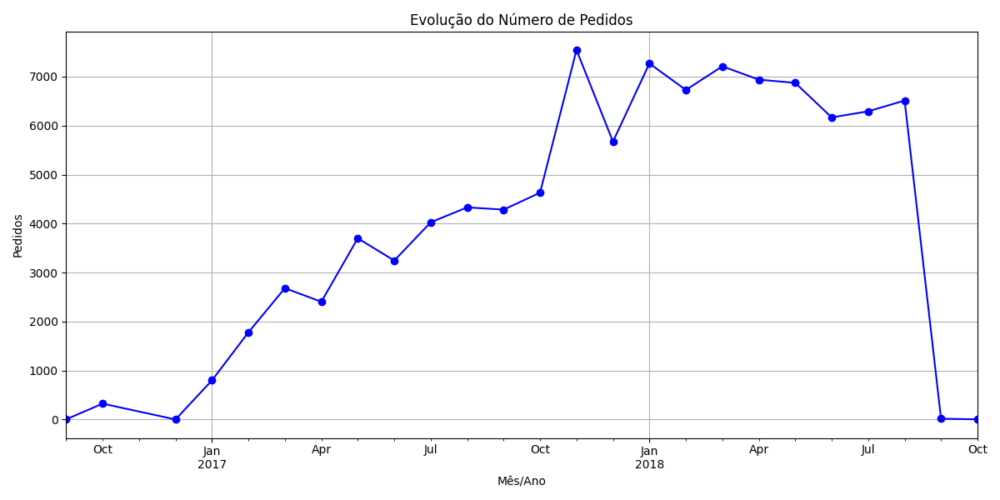
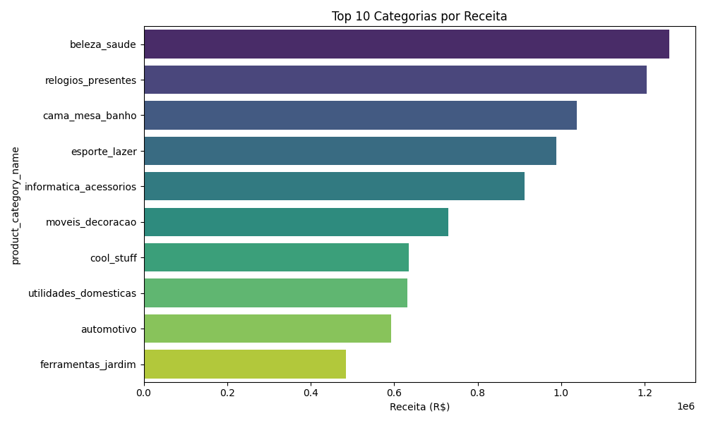
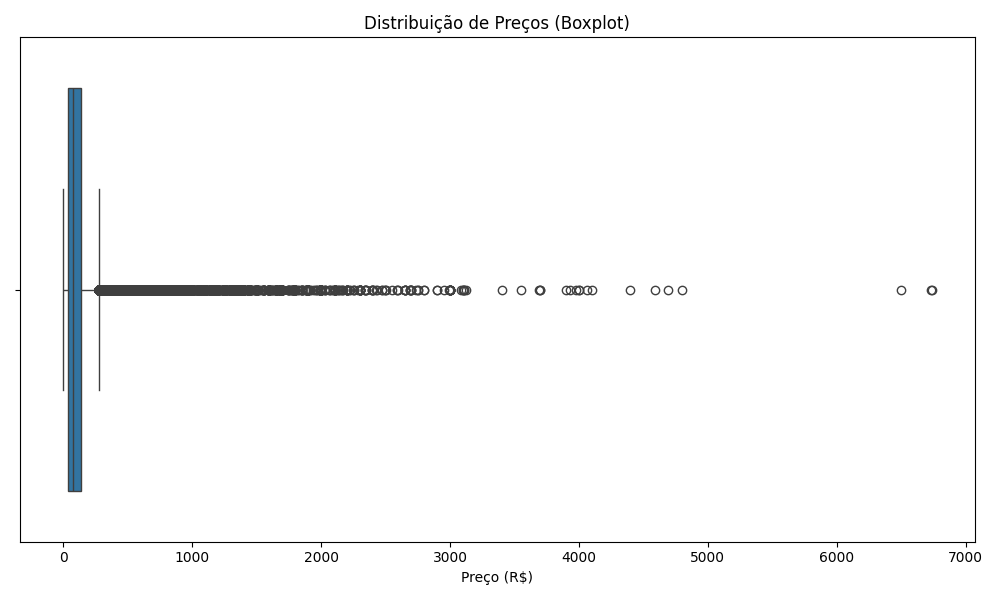
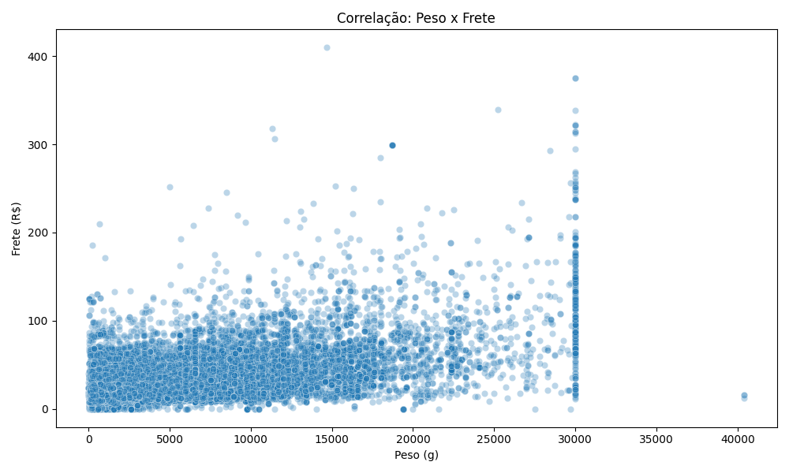
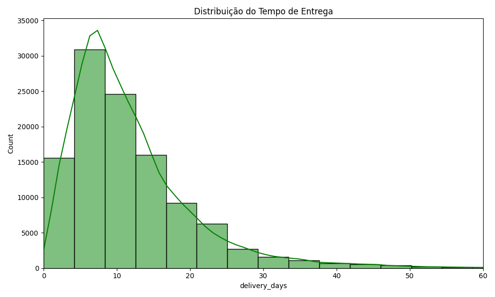

# 📊 Olist E-Commerce: Análise de Dados e Pipeline de Engenharia


## 📝 Sobre o Projeto
Este projeto consiste na análise exploratória, limpeza e analise de dados de um dataset real de e-commerce brasileiro (Olist). O objetivo foi transformar dados brutos relacionais em insights de negócio e preparar uma base consolidada para dashboarding.

O projeto simula um cenário real de um Analista de Dados, onde é necessário validar a qualidade dos dados, criar novas métricas e entregar valor para a tomada de decisão.

## 🗂️ Fonte de Dados
Os dados públicos foram obtidos do **Brazilian E-Commerce Public Dataset by Olist** (Kaggle).
O esquema original conta com 8 tabelas relacionais. Para este projeto, focamos na modelagem das seguintes tabelas principais:
- `orders`: Pedidos e status
- `order_items`: Detalhes dos itens comprados
- `products`: Cadastro de produtos e categorias

## 🛠️ Tecnologias Utilizadas
- **Python**: Linguagem principal.
- **Pandas**: Manipulação e tratamento de dados (ETL).
- **Matplotlib & Seaborn**: Visualização de dados estática.
- **VS Code & Jupyter Notebook**: Ambiente de desenvolvimento.

## ⚙️ Etapas do Pipeline de Dados

### 1. Ingestão e Validação
- Carregamento de múltiplos arquivos CSV (formato Flat File).
- Verificação de tipos de dados (Schema Validation).
- Identificação de volumetria e consistência.

### 2. Tratamento e Limpeza (Data Cleaning)
- **Correção de Tipos:** Conversão de colunas de data (`order_purchase_timestamp`, etc) que estavam como string.
- **Tratamento de Nulos:** Remoção de registros inconsistentes para análises de peso e frete.

### 3. Modelagem e Cruzamento (Data Modeling)
- Criação de uma Tabela Analítica (OBT - One Big Table) através de JOINs (`merge`):
  - `Orders` LEFT JOIN `Items` ON `order_id`
  - RESULT LEFT JOIN `Products` ON `product_id`

### 4. Engenharia de Atributos (Feature Engineering)
Criação de novas colunas para enriquecer a análise:
- `month_year`: Para análise temporal (safra).
- `delivery_days`: Cálculo do tempo de entrega (Data Entrega - Data Compra).

## 📊 Principais Insights Obtidos

### 1. Evolução Temporal das Vendas
Notou-se um crescimento consistente no volume de pedidos a partir de 2017, com clara tendência de alta e estabilização em 2018.


### 2. Categorias Campeãs (Receita)
As categorias como "Beleza e Saúde" e "Relógios Presentes" lideram o faturamento, indicando o perfil de consumo predominante na plataforma.


### 3. Distribuição de Preços (Ticket Médio)
O Boxplot revela que a grande concentração de vendas ocorre em produtos de ticket baixo/médio. No entanto, há diversos *outliers* (pontos fora da curva) de valor muito alto que puxam a média para cima.



### 4. Correlação Logística (Peso x Frete)
Confirmamos através do gráfico de dispersão que existe uma correlação positiva: quanto maior o peso do produto, maior tende a ser o valor do frete pago pelo cliente.


### 5. Performance de Entrega
O histograma demonstra que a eficiência logística é alta, com a maioria das entregas concentrada nos primeiros dias (assimetria à direita). Porém, nota-se uma "cauda longa", representando pedidos que sofreram atrasos significativos.


## 🚀 Como Executar
1. Clone o repositório.
2. Baixe o dataset no Kaggle e coloque na pasta `data/raw`.
3. Instale as dependências:
   ```bash
   pip install pandas seaborn matplotlib 